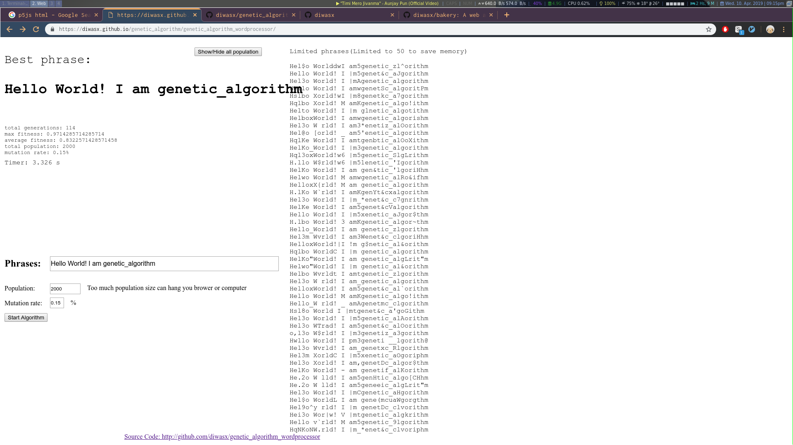

# Genetic Algorithm word processor
 
  <h3 align="center">Word processor based on genetic algorithm</h3>

  

    This is a word processor application that perform genetic algorithm on population of random letters and characters.
     
    <a target="_blank" href="https://diwasx.github.io/genetic_algorithm/genetic_algorithm_wordprocessor/">View Demo</a>
    ·
    <a href="https://github.com/diwasx/genetic_algorithm_wordprocessor/issues">Report Bug</a>
  

<!-- TABLE OF CONTENTS -->
## Table of Contents

* [About the Project](#about-the-project)
  * [Darwinian Natural Selection](#darwinian-natural-selection)
  * [Built With](#built-with)
* [Contributing](#contributing)
* [License](#license)
* [Let's Get Social](#lets-get-social)
* [Contact](#contact)
* [Acknowledgements](#acknowledgements)

<!-- ABOUT THE PROJECT -->
### About The Project

This is a word processor application that perform genetic algorithm on population of random letters and characters. This application is based on Darwinian's Natural Selection, the process that drives biological evolution. Natural selection is the differential survival and reproduction of individuals due to differences in phenotype. It is a key mechanism of evolution, the change in the heritable traits characteristic of a population over generations. 

### Darwinian Natural Selection
The genetic algorithm repeatedly modifies a population of individual solutions. At each step, the genetic algorithm selects individuals at random from the current population to be parents and uses them to produce the children for the next generation. Over successive generations, the population "evolves" toward an optimal solution. 

* Heredity. There must be a process in place by which children receive the properties of their parents. If creatures live long enough to reproduce, then their traits are passed down to their children in the next generation of creatures.

* Variation. There must be a variety of traits present in the population or a means with which to introduce variation. For example, let’s say there is a population of beetles in which all the beetles are exactly the same: same color, same size, same wingspan, same everything. Without any variety in the population, the children will always be identical to the parents and to each other. New combinations of traits can never occur and nothing can evolve.

* Selection. There must be a mechanism by which some members of a population have the opportunity to be parents and pass down their genetic information and some do not. This is typically referred to as “survival of the fittest.” For example, let’s say a population of gazelles is chased by lions every day. The faster gazelles are more likely to escape the lions and are therefore more likely to live longer and have a chance to reproduce and pass their genes down to their children. The term fittest, however, can be a bit misleading. Generally, we think of it as meaning bigger, faster, or stronger. While this may be the case in some instances, natural selection operates on the principle that some traits are better adapted for the creature’s environment and therefore produce a greater likelihood of surviving and reproducing. It has nothing to do with a given creature being “better” (after all, this is a subjective term) or more “physically fit.” 

### Built With

* [Javascript](https://www.javascript.com/)
* [P5.js](https://p5js.org/)

<!-- CONTRIBUTING -->
## Contributing

Contributions are what make the open source community such an amazing place to be learn, inspire, and create. Any contributions you make are **greatly appreciated**.

1. Fork the Project
2. Create your Feature Branch (`git checkout -b feature/AmazingFeature`)
3. Commit your Changes (`git commit -m 'Add some AmazingFeature`)
4. Push to the Branch (`git push origin feature/AmazingFeature`)
5. Open a Pull Request

<!-- LICENSE -->
## License

Distributed under the MIT License. See `LICENSE` for more information.

<!-- LET'S GET SOCIAL -->
## Let's Get Social

* [Facebook](https://facebook.com/diwas.ale)
* [Github](https://github.com/diwasx)

<!-- CONTACT -->
## Contact

Diwash Ale - diwasx@gmail.com

Project Link: [https://github.com/diwasx/genetic_algorithm_wordprocessor](https://github.com/diwasx/genetic_algorithm_wordprocessor)

<!-- ACKNOWLEDGEMENTS -->
## Acknowledgements
* [Youtube series](https://www.youtube.com/playlist?list=PLRqwX-V7Uu6bw4n02JP28QDuUdNi3EXxJ)
* [P5.js Documentation](https://p5js.org/get-started/)
* [Nature of Code](https://natureofcode.com/book/chapter-9-the-evolution-of-code/)
